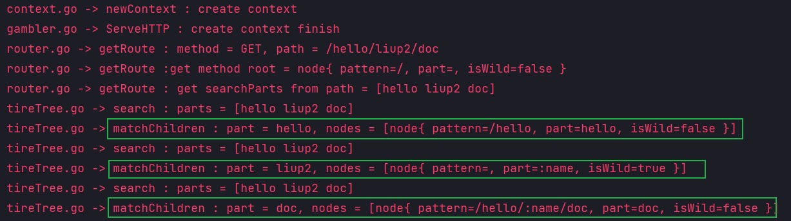

# Web 网络框架 gambler
[toc]
<br>
<br>
Go语言中的网络框架有 Beego，Gin，Iris，本框架模仿 Gin 的设计。其实很多语言都提供了有关网络的标准库，为什么还有那么多网络框架出现呢？

Golang 的标准库 net/http 提供了基础的Web功能，即监听端口，映射静态路由，解析HTTP报文，处理一个请求的简单过程如下：

```go
func main() {
    http.HandleFunc("/", handler)
    http.HandleFunc("/count", counter)
    log.Fatal(http.ListenAndServe("localhost:8000", nil))
}

func handler(w http.ResponseWriter, r *http.Request) {
    fmt.Fprintf(w, "URL.Path = %q\n", r.URL.Path)
}
```

如果不使用框架，使用基础库时，需要频繁手工处理的地方，就是框架的价值所。

## 一、net / http 库的简单使用

首先设置路由以及该路由的处理函数

```go
http.HandleFunc("/", indexHandler)
```
然后启动 Web 服务。第一个参数是监听的地址；第二个参数是一个 名为 Handler 的接口，接口中定义了一个 ServeHTTP 方法，代表处理所有 HTTP 请求的实例，使用 nil 表示使用标准库中的实例进行处理。第二个参数是实现框架的入口。

```go
http.ListenAndServe(":9999", nil)
```
任何实现了 ServeHTTP 方法的实例都可以作为这个监听函数的第二个参数。

```go
func (engine *Engine) ServeHTTP(w http.ResponseWriter, req *http.Request)
```
第一个参数可以利用 ResponseWriter 构造指针，从而对该请求实现响应。

第二个参数包含了该次请求的所有信息，例如请求地址、Header和Body等。

可以通过创建一个实例，如 engine，并给 engine 实现 ServeHTTP 方法，这样就可以把 HTTP 的请求导向到自己编写的处理逻辑中。在使用 engine 之前，只能对每一个路由设置处理逻辑，但是有了 engine 之后就有了统一的控制入口，可以拦截所有的 HTTP 请求。在这个地方可以自定义一些路由的映射规则，也可以添加一些异常处理或者中间件等。

## 二、框架设计和实现
### 1、engine 实例的基础设计
engine 是框架的主体，后续的功能都是在 engine 实例内添加的，并通过 enging 实例进行调用。engine 承载了后续所有功能，因此在后续的功能编写中会对 engine 不断更新或者新增新的方法。基础的 engine 实例提供路由和处理函数的映射功能、路由注册功能。

首先定义一个 HandlerFunc 函数类型，这个类型就是 handler 函数，提供给用户用于编写处理逻辑函数。
    
```go
type HandlerFunc func(http.ResponseWriter, *http.Request)
```

所以在 engine 中必须要有一个保存路由和处理函数映射关系的成员变量。其中 key 由 请求方式 + 静态路由构成：GET-/、GET-/hello、POST-/hello
    
```go
type Engine struct {
    router map[string]HandlerFunc
}
```

除了创建，还需要提供一些基础的方法：

创建 engine 实例：
    
```go
func New() *Engine
```

添加路由：建立请求 URL 和 处理函数 HandlerFunc 的映射关系。

```go
 func (engine *Engine) addRoute(method string, pattern string, handler HandlerFunc)
```

添加 GET 和 POST 方法的 URL 映射关系：调用 addRoute()，这样使得相同的 URL 采用不同的请求方式会采用不同的处理逻辑去处理。pattern 是静态路由。
    
```go
func (engine *Engine) GET(pattern string, handler HandlerFunc) {
    engine.addRoute("GET", pattern, handler)
}
```

启动 Web 服务：其实是对 http.ListenAndServe 的封装。

```go
func (engine *Engine) Run(addr string) (err error)
```

实现 ServeHTTP 方法：解析请求的路径，查找路由映射表。如果查到，就执行注册的处理方法。如果查不到，就返回 404

```go
func (engine *Engine) ServeHTTP(w http.ResponseWriter, req *http.Request) 
```

### 2、上下文设计

使用 context 上下文来封装 http.ResponseWriter 和 *http.Request，这是非常必要的。

对于 Web 框架来说，本质上就是根据 *http.Request 构造响应 http.ResponseWriter。但是这两个对象提供的接口粒度太细，导致构造一个响应时会有很多重复的设置，例如构造响应时要考虑 消息头 Header 和 消息体 Body。在 Header 中包含了状态码、消息类型等，几乎每次请求都需要设置。可以将一些重复的功能进行封装便于复用，例如设置请求头状态码等等。

对于使用场景来说，简化调用只是 context 上下文的一部分意义。除此之外对于一个框架来说还需要支持一些额外的功能，例如动态路由的解析参数保存、中间件产生的信息保存等。context 和一个请求是相互对应的，因此 context 中应该承载和这个请求强相关的一些信息。通过 context 把复杂性留在内部，对外简化了调用。路由的处理函数，以及将要实现的中间件，参数都统一使用 Context 实例承载，Context 就像一次会话的百宝箱，可以找到任何东西。

```go
// Context 构建上下文的字段
type Context struct {
    // 原始字段
    Writer     http.ResponseWriter
    Req        *http.Request
    Path       string            // req 请求信息
    Method     string            // req 请求信息
    StatusCode int               // resp 响应信息
    Params     map[string]string // 保存动态路由解析后的参数
    handlers   []HandlerFunc     // 中间件部分：这个列表中表示里面的 handler 可能会结合中间件进行处理
    index      int               // 中间件部分：表示执行到了第几个中间件
    engine     *Engine           // 用于能够通过 Context 来访问 engine 的 HTML 模板，在实例化的时候需要给 engine 赋值
}
```

context 提供的方法有：

newContext 创建新的 context

```go
func newContext(w http.ResponseWriter, req *http.Request) *Context
```

PostForm 封装 FromValue 方法,获取表单中指定 key 的值，或者获取 url 中? 后面的请求参数。

```go
func (c *Context) PostForm(key string) string
```

Query 封装 Query().Get(key) 方法，获取 url 中? 后面的请求参数

```go
func (c *Context) Query(key string) string
```

GetParam 获取url中 key 对应的值的方法，对应于动态路由解析后的参数

```go
func (c *Context) GetParam(key string) string
```

SetStatus 设置响应头，也就是状态码
    
```go
func (c *Context) SetStatus(code int)
```

SetHeader 设置 Header, key - value 的形式，例子如下

```go
// Header["Connection"] = ["keep-alive"]
// Header["User-Agent"] = ["Mozilla/5.0 (Windows NT 10.0; Win64; x64) AppleWebKit/537.36 (KHTML, like Gecko) Chrome/111.0.0.0 Safari/537.36"]
   
 func (c *Context) SetHeader(key string, value string)
```

String 构造 string 类型响应的方法，其中 ... 表示可以接受任意数量的接口类型，也就是任意类型

```go
func (c *Context) String(code int, format string, value ...interface{})
```

JSON 构造 JSON 类型响应的方法，接口类型可以表示任意值
    
```go
func (c *Context) JSON(code int, obj interface{})
```

Data 构造 Data 类型响应的方法，接口类型可以表示任意值

```go
func (c *Context) Data(code int, data []byte)
```

HTML 构造 HTML 类型的响应方法，接口类型可以表示任意值, 可以根据模板文件名选择模板进行渲染

```go
func (c *Context) HTML(code int, name string, data interface{})
```

注意：实现完上下文之后，engine 的 serveHTTP 中的逻辑就变成了创建一个 context。

### 3、路由映射设计
在这里把路由相关的功能抽离出来，便于对路由功能进行增强。router首先要能保存路由和处理方法的映射关系。
    

```go
type router struct {
    handlers map[string]HandlerFunc     // 保存路由 - 处理函数的映射关系
}
```

提供 addRouter 方法，将 engine 中的 注册路由方式转移到这里，这样 engine 只需要调用router 的 addRouter 方法即可。

```go
func (r *router) addRoute(method string, pattern string, handler HandlerFunc)
```

提供 handle 方法，将该请求的上下文和这个路由对应的处理函数绑定，或者说把上下文作为参数传递给处理函数。具体来说是通过上下文携带的参数拼接出 key，并用这个 key 获得对应的 HandlerFunc，把上下文作为参数传递给 HandlerFunc。

```go
func (r *router) handle(c *Context) {
    // 拿到前缀树的节点
    n, params := r.getRoute(c.Method, c.Path)
    if n != nil {
        c.Params = params
        key := c.Method + "-" + n.pattern
        // r.handlers[key] 已经是一个 handlerFunc 了
        // (c) 传递了参数就代表了执行，可以参考匿名函数的执行 
        r.handlers[key](c)
    } else {
        c.String(http.StatusNotFound, "404 NOT FOUND: %s\n", c.Path)
    }
}
```

### 4、路由解析设计
使用map存储键值对，索引非常高效，但是有一个弊端，键值对的存储的方式，只能用来索引静态路由。也因此静态路由的解析非常容易实现，只需要通过上下文中提供的信息拼接出 key，用这个 key 去查找映射即可。

动态路由指的是一条路由规则可以匹配某一类型而非某一条固定的路由。例如： /hello/:name 可以匹配 /hello/tom 和 hello/jack 等等。动态路由最常用的实现方式就是前缀树了。前缀树的特点就是每一个节点的所有子节点都有相同的前缀。

这里实现的动态路由有两种匹配方式：

1）参数匹配：例如：/p/:lang/doc，可以匹配 /p/c/doc 和 /p/go/doc

2）*通配：这种模式常用于静态服务器，能够递归地匹配子路径。例如：/static/*filepath，可以匹配/static/fav.ico，也可以匹配/static/js/jQuery.js

首先要确定前缀树的节点上要保存哪些信息。当我们匹配 /p/go/doc/这个路由时，第一层节点，p 精准匹配到了 p，第二层节点，go 模糊匹配到 :lang，那么将会把 lang 这个参数赋值为 go ，继续下一层匹配。

**一个节点的结构如下：**

```go
type node struct {
    pattern  string  // 准备匹配的路由，eg: /p/:lang
    part     string  // 路由中的一部分，eg: :lang
    children []*node // 子节点，eg: [doc, tutorial, intro]
    isWild   bool    // 是否是模糊匹配，part含有 : 或 * 时为Ture
}
```

_**为了实现前缀树的创建**_ 需要一个辅助函数 matchChild ，目的是用于找到要注册的这个路由中已经注册了的节点，用于更新前缀树，设置新的路由。
    
```go
func (n *node) matchChild(part string) *node
```
如下是一个在已经注册了 /hello/:name 路由的情况下，注册 /hello/:name/doc 路由的过程, 可以看到该函数的作用是找到这个路由中已经注册的部分。


如果是在注册了 /hello 的情况下注册 /hello/:name/doc，那么是无法直接访问 /hello/:name 的，因为虽然会创建 :name 这个节点，但是这个节点的 pattern 值为空，后续无法通过查询得到这个节点。


**_使用 insert 函数插入节点_**，这个函数是使用递归实现的，pattern 是完整的路由，parts 是以 / 划分后得到的字符串， height 用于标记递归深度，在递归过程中会不断自增，直到等于 parts 的长度。 递归逻辑是在前缀树中寻找 part 值等于 parts[height] 的节点，找不到就创建新节点，但是递归结束才会设置 pattern 值，这对应上面提到的场景。如果节点的开始带有 : 或 * 等我们设置的特殊路由，则设定相应的 isWild 标记。最后把这个节点加入到 children 中，进行下一次递归。

```go
func (n *node) insert(pattern string, parts []string, height int)
```


**为了实现前缀树的查询** 也需要一个辅助函数 matchChildren 用于查找所有匹配的节点。例如，在注册了 /hello 和 /hello/:name/doc 的情况下， /hello/liup2/doc 会匹配到 三个节点，如下图所示

```go
func (n *node) matchChildren(part string) []*node
```


**_使用 search 来匹配路由_**，这个函数同样要使用递归实现， parts 是路由按照 / 分割后的结果，height 代表递归深度。递归结束条件是递归深度等于 parts 的长度或者 这个节点的 part 是模糊匹配的。递归结束时判断递归到的节点的 pattern 值是否为空，为空则匹配失败，场景在上面提到过。不为空则匹配成功返回这个节点。

```go
func (n *node) search(parts []string, height int) *node {
```

**前缀树的插入和查询功能都实现了，接下来需要把前缀树功能添加到路由映射中。**
在 router 中，需要新增一个成员变量 roots 来保存每一种请求的根节点。

```go
// roots key eg, roots['GET'] roots['POST']
// handlers key eg, handlers['GET-/p/:lang/doc'], handlers['POST-/p/book']
type router struct {
    roots    map[string]*node       // 存储每种请求方式的 Trie 树根节点
    handlers map[string]HandlerFunc // 存储每个路由对应的 HandlerFunc
}
```

然后在 route 修改 addRouter 函数，新增插入前缀树节点的功能。

```go
r.roots[method].insert(pattern, parts, 0)
```

新增获取节点的功能函数 getRoute，实现对前缀树路由的解析，返回值是 node 和 解析的结果, key 是路由中可变部分， value 是路由中对应这个可变部分的值。 eg : searchParts = /p/go/doc， node.pattern = /p/:lang/doc, 解析结果为：{lang: "go"}

```go
func (r *router) getRoute(method string, path string) (*node, map[string]string) {
    params := make(map[string]string)
    // 尝试得到对应请求方式的 前缀树根节点
    root, ok := r.roots[method]
    if !ok {
        return nil, nil
    }
    // 解析请求路径得到 parts
    searchParts := parsePattern(path)
    // 成功拿到对应请求的前缀树后查找匹配当前路径的节点
    n := root.search(searchParts, 0)
    if n != nil {
        // 解析这个节点的路径
        parts := parsePattern(n.pattern)
        // 准备解析的结果，用 params 保存，key 是 节点， value 是 路径
	    // 利用 index 实现对应
        for index, part := range parts {
            // :开头的只需要拿到这个 part
            if part[0] == ':' {
                // part[1:] = lang, searchParts[index] = go
                params[part[1:]] = searchParts[index]
            }
            // *开头的使用 [index:] 一次性拿到了路径
            if part[0] == '*' && len(part) > 1 {
                // part[1:] = filepath, 后面是把剩余的 part 用 / 连接
                params[part[1:]] = strings.Join(searchParts[index:], "/")
                break
            }
        }
        return n, params
    }
    return nil, nil
}
```

解析后得到的结果可能是有价值的信息，所以要修改 context，增加 map[string]string 类型的成员变量 Params，用于保存动态路由解析结果。同时提供一个函数来获取这个结果。

```go
func (c *Context) GetParam(key string) string
```

解析结果的保存功能是在 router 的 handle 函数中实现的，在 handle 函数中调用 getRoute 函数，得到请求路由对应的节点和解析结果。然后把上下文作为参数传递给 HandlerFunc。

```go
r.handlers[key](c)
```

### 5、路由分组设计
分组控制(Group Control)是 Web 框架应提供的基础功能之一。所谓分组，是指路由的分组。如果没有路由分组，我们需要针对每一个路由进行控制。但是真实的业务场景中，往往某一组路由需要相似的处理。

    eg:
        以/post开头的路由匿名可访问。
        以/admin开头的路由需要鉴权。
        以/api开头的路由是 RESTful 接口，可以对接第三方平台，需要三方平台鉴权。

大部分情况下的路由分组，是以相同的前缀来区分的。因此，这里实现的分组控制也是以前缀来区分，并且支持分组的嵌套。例如/post是一个分组，/post/a和/post/b可以是该分组下的子分组。作用在/post分组上的中间件，也都会作用在子分组，子分组还可以应用自己特有的中间件。中间件可以给框架提供无限的扩展能力，应用在分组上，可以使得分组控制的收益更为明显，而不是共享相同的路由前缀这么简单。例如/admin的分组，可以应用鉴权中间件；/分组应用日志中间件，/是默认的最顶层的分组，也就意味着给所有的路由，即整个框架增加了记录日志的能力。

考虑 Group 对象需要什么属性。首先是前缀，例如 /api 或者 /，代表这个分组，后续的路由都要在这个基础上进行拼接。中间件是作用在分组上的，因此需要保存一个分组对象所使用的中间件。除此之外 Group 还需要使用 engine 中已经存在的 route路由的功能，所以要添加一个指向 engine 的指针。

```go
type RouterGroup struct {
    prefix      string        // 例如 / 或者 /api
    middlewares []HandlerFunc // 支持中间件
    parent      *RouterGroup  // 为了支持嵌套分组，需要知道父分组
    engine      *Engine       // 需要有访问 router 的能力，所以保存一个指向 engine 的指针，方便通过 engine 访问各种接口，也意味着框架的资源由 engine 协调
}
```
同时，由于 engine 是框架的最终控制部分，所以在 engine 中嵌套一个 RouterGroup，并使用 groups 来保存所有的分组。

```go
// Engine 定义实例引擎,集中保存管理路由
// 嵌套类型是指将已有的类型直接声明在新的结构类型里。
// *RouterGroup 被称作内部类型 Engine 被称为外部类型。
// 内部类型的属性、方法，可以为外部类型所有，就好像是外部类型自己的一样。
// 外部类型还可以定义自己的属性和方法，甚至可以定义与内部相同的方法，这样内部类型的方法就会被“屏蔽”
type Engine struct {
    router        *router            // 定义路由：key 是理由，value 是处理函数
    *RouterGroup                     // engine 是最顶层的分组，拥有 RouterGroup 的所有能力
    groups        []*RouterGroup     // 保存所有的 group
    htmlTemplates *template.Template // 使用 html/template 的渲染能力，把模板加载到内存中(还有一个text/template)
    funcMap       template.FuncMap   // 保存所有的自定义模板渲染函数, 是一个map
}
```

之后就可以将之前有路由控制的相关函数交给 RouterGroup 来实现。

```go
func (engine *Engine) addRoute(method string, pattern string, handler HandlerFunc) {
    engine.router.addRouter(method, pattern, handler)
}
↓ ↓ ↓
func (group *RouterGroup) addRoute(method string, comp string, handler HandlerFunc) {
    // comp 是不包含前缀的路径，在真正添加路由的时候需要拼接起来
    pattern := group.prefix + comp
    group.engine.router.addRouter(method, pattern, handler)
}
```

由于在 engine 中嵌套了 RouterGroup，engine 作为外部类型拥有 内部类型 RouterGroup 的所有函数和成员变量，因此 engine 还可以像之前那样注册路由。因为如果通过 engine 直接调用 GET 或者 POST 等方式注册路由，由于没有创建分组，所以分组的 prefix 是空，相当于直接注册路由。

下面给出使用的示例：
    
```go
r := gambler.New()
// 直接注册，此时是 engine 调用了 group 的 GET 方法进而调用 group 的 addRoute 方法注册路由
r.GET("/hello", func(c *gambler.Context) {
    // 注册的是 /hello 路由
})

g1 := r.NewGroup("/g1")
g1.GET("/", func(c *gambler.Context) {
    // 注册路由 /g1/
})
g1.GET("/hello", func(c *gambler.Context) {
    // 注册路由 /g1/hello
})
```

### 6、中间件设计
中间件 (middlewares) 简单来说就是非业务的技术类组件。 Web 框架本身无法理解所有的业务，所以框架需要一个插口允许用户自定义功能嵌入到框架中，就像是框架原生的一样。所以考虑一个中间件需要考虑插入点的位置和中间件的输入。

中间件的插入点太靠近用户的话，那中间件的意义就会降低，因为这样和用户自己定义一组函数在 handler 中手工调用区别不大。太靠近框架会导致中间件的逻辑过于复杂。

中间件暴露的参数太少用户发挥的空间就会受限。

在本框架中，中间件的插入位置为 框架接收到初始化 context 对象请求后，允许用户自己定义的中间件做一些额外的处理，例如记录日志以及对 context 二次加工等。同时在 context 中提供一个用户切换 中间件 的函数，用于等待用户自己定义的 Handler处理结束后，再做一些额外的操作，例如计算本次处理所用时间等。

**_综上所述，中间件支持用户在请求被处理的前后做一些额外的操作，并且支持设置多个中间件，依次调用。_**

中间件是应用在分组上的，如果应用在最顶层的 group 相当于作用于全局。只作用在某一条路由规则上的中间件不具有通用性，不如直接定义在 handler 中直接。

框架的流程是，当接收到请求后进行路由匹配，这个请求的所有信息都会被保存到 context 中。对于中间件的处理也是一样，接收到请求后查找所有应该作用于该路由的中间件并保存到 context 中，依次进行调用。这个保存是必要的，因为中间件不仅在 handler 之前发挥作用，还会在 handler 之后发挥作用。

因此需要给 context 添加一个 Next() 方法用于进行控制权的切换。还需要一个 index 成员变量用于标记当前在执行哪一个中间件。还需要一个 handlers []HandlerFunc 来保存中间件。

```go
func (c *Context) Next() {
    c.index++
    s := len(c.handlers)
    for ; c.index < s; c.index++ {
        // 切换中间件的控制，参考匿名函数的执行
        // 匿名函数的最后传入参数就代表执行
        c.handlers[c.index](c)
    }
}
```

具体的逻辑是：使用 index 记录执行到第几个中间件了，在当前中间件中执行 Next() 方法时，就会切换到下一个中间件去执行，直到最后一个中间件，一般是用户的 handler。在用户的 handler 执行完毕之后，会返回前一个中间件去执行 Next() 方法后面的部分，以此类推直到回到最开始的中间件。类似于一个栈的调用过程。

举例：现在有 中间件 A、中间件 B 和 handler，他们都保存在 handlers 中。

```go
func A(c *Context) {
    part1
    // 此时切换到了 中间件B
    c.Next()
    // 中间件B 执行完毕
    part2
}

func B(c *Context) {
    part3
    // 此时切换到了 handler 
    c.Next()
    // handler执行完毕
    part4
}
```

执行的结果是：part1 -> part3 -> Handler -> part 4 -> part2

**_下面说一下具体实现：_**

首先要定义一个注册中间件的方法，由于是作用于分组，所以这个方法的接接收者是 group *RouterGroup。但是 engine 也可以直接调用，原因和之前的一样。另外中间件的注册一定是 engine 创建或者 分组创建之后进行的，其实 engine 的创建可以理解为一个 / 跟分组。逻辑也很简单，就是把中间件保存到对应分组的中间件列表中，然后在 serveHTTP 中对这个中间件列表进行处理。

```go
func (group *RouterGroup) UseMiddlewares(middlewares ...HandlerFunc) {
    group.middlewares = append(group.middlewares, middlewares...)
}
```

ServeHTTP 的处理逻辑修改：拿到这个分组的中间件列表ing添加到上下文的中间件列表中，这样 上下文传递给 handler 时就携带了应该执行的中间件的列表。

```go
func (engine *Engine) ServeHTTP(w http.ResponseWriter, req *http.Request) {
    // 为适配中间件而增添的部分
    var middlewares []HandlerFunc
    // 拿到和请求对应的分组的所有 中间件 并赋值给 上下文的 hanslers 列表
    for _, group := range engine.groups {
        if strings.HasPrefix(req.URL.Path, group.prefix) {
            middlewares = append(middlewares, group.middlewares...)
        }
    }
    // 实例化一个 Context
    c := newContext(w, req)
    // 将中间件列表添加到这个上下文的 hanslers 列表中
    c.handlers = middlewares
    // 用于 Context 使用 engine 的方法
    c.engine = engine
    // 用于将 上下文传递给 handle 函数
    engine.router.handle(c)
}
```

路由部分的 handle() 方法也需要修改：此时的 handle 目的就是找到路由对应的 handler 并把这个handler 添加到 上下文的 handlers 列表中。最后执行 Next() 方法，在 Next() 方法中会根据 index 等控制逻辑，去执行每一个 中间件 和 handler。执行方式参考匿名函数的执行。


```go
func (r *router) handle(c *Context) {
    // 拿到前缀树的节点
    n, params := r.getRoute(c.Method, c.Path)
    if n != nil {
        c.Params = params
        key := c.Method + "-" + n.pattern
        // r.handlers[key] 是和当前路由对应的 handlerFunc
        // 这一步骤是将与这个路由匹配的 handler 函数添加到 handlers 列表中
        // 这个列表中已经包含了要执行的中间件，是在前一步 ServeHTTP 中添加的
        c.handlers = append(c.handlers, r.handlers[key])
    } else {
        c.handlers = append(c.handlers, func(c *Context) {
            c.String(http.StatusNotFound, "404 NOT FOUND : %s\n", c.Path)
        })
    }
    // Next() 中从上下文的 handlers 列表中拿出中间件和 handler 执行
    // Next() 中的执行方式 ：c.handlers[c.index](c) 
    c.Next()
}
```

### 7、模板渲染设计
前后端分离的开发模式是目前主流的开发模式，web 后端提供 RESTful 接口，返回结构化的数据，前端使用 Ajax 技术请求到所用的数据，利用 JavaScript 进行渲染。后端专注解决资源利用、并发、数据库等问题，只需要考虑数据如何生成。这样做不仅能够让前后端专注于自己的任务，而且可以实现同一套后端支持移动端和PC端以及对外的接口。前后端分离的问题在于页面是在客户端渲染的，这对爬虫不友好，爬虫更擅长爬取服务端渲染额的 HTML 页面。

之前在设计路由的时候有一个通配模式，使用 * 可以支持多级匹配，/assets/*filepath，可以匹配/assets/开头的所有的地址。例如 /assets/js/geektutu.js，匹配后参数 filepath 就赋值为 js/geektutu.js

**_1）静态文件的获取：_**

如果将所有的静态文件放在 /usr/web/static 下，那么 filepath 的值就是该目录下文件的相对地址，映射到真实地址之后就可以返回文件，静态服务器就实现了。返回文件的这一步不需要自己实现， net/http 库已经实现了，框架要做的只是解析请求的地址，映射到服务器上下文的真实地址，交给 http.FileServer 处理。

给 group 添加一个创建静态文件的 handler 的函数，逻辑是 首先通过分组前缀和这个相对路径拼接拿到一个请求的绝对路径。第二个参数 http.FileSystem 是一个接口，需要实现一个 Open() 方法。这个参数是通过使用 http.Dir(root) 得到的，Dir 实现了 Open接口。root 就是静态资源文件在服务器上的绝对路径。

```go
func (group *RouterGroup) createStaticHandler(relativePath string, fs http.FileSystem) HandlerFunc {
    // 拿到绝对路径
    absolutePath := path.Join(group.prefix, relativePath)
    // StripPrefix将URL中的前缀中的prefix字符串删除，然后再交给后面的Handler处理，返回值是一个 handler
    // http.FileServer 返回一个 handler，
    fileServer := http.StripPrefix(absolutePath, http.FileServer(fs))
    return func(c *Context) {
        // 获取文件名
        file := c.GetParam("filepath")
        if _, err := fs.Open(file); err != nil {
            // 文件打开失败
            c.SetStatus(http.StatusNotFound)
            return
        }
        // 拿到文件后就可以交给 http.FileServer 来处理了
        fileServer.ServeHTTP(c.Writer, c.Req)
    }
}
```

然后提供一个 Static 方法方便用户将相对路径 和 绝对路径 相互映射。在这个方法中调用 createStaticHandler 方法得到一个 handler，这个就是静态文件资源服务器。最后把这个 handler 和 请求的路径相互映射。

```go
func (group *RouterGroup) Static(relativePath string, root string) {
    handler := group.createStaticHandler(relativePath, http.Dir(root))
    urlPattern := path.Join(relativePath, "/*filepath")
    group.GET(urlPattern, handler)
}
```

**_2）HTML 模板渲染_**

Go 语言内置了 text/template 和 html/template 两个标准模板库，其中后者为 HTML 提供了比较完整的支持，包括普通变量的渲染、列表渲染、对象渲染等等。这里直接使用  html/template 实现渲染。

首先需要为 engine 添加两个成员变量。*template.Template 用于将模板加载到内存中；template.FuncMap 是所有自定义模板的渲染函数。

```go
type Engine struct {
    router        *router            // 定义路由：key 是理由，value 是处理函数
    *RouterGroup                     // engine 是最顶层的分组，拥有 RouterGroup 的所有能力
    groups        []*RouterGroup     // 保存所有的 group
    htmlTemplates *template.Template // 使用 html/template 的渲染能力，把模板加载到内存中(还有一个text/template)
    funcMap       template.FuncMap   // 保存所有的自定义模板渲染函数, 是一个map
}
```

首先提供给用户一个设置自定义渲染的函数。

```go
// SetFuncMap 用于设置自定义函数渲染模板 funcMap
func (engine *Engine) SetFuncMap(funcMap template.FuncMap) {
    engine.funcMap = funcMap
}
```

然后要给用户提供一个函数用于加载所有的模板。

template.Must() 让 template 对象加载模板，如果加载不到，就产生panic。

Funcs(engine.funcMap) 将参数映射的元素添加到模板的函数映射中。必须在解析模板之前调用，返回值是 template 可以链式调用。

ParseGlob(pattern) 表示解析模板所在的文件路径 如 templates/* 表示解析 templates 下所有的模板。

```go
func (engine *Engine) LoadHTMLGlob(pattern string) {
    engine.htmlTemplates = template.Must(template.New("").Funcs(engine.funcMap).ParseGlob(pattern))
}
```

提供一个使用示例便于理解。

```go
// 使用示例：

// 在 tools 包中编写以下函数
func FormatAsDate(t time.Time) string {
    year, month, day := t.Date()
    return fmt.Sprintf("%d-%02d-%02d", year, month, day)
}

// 设置自定义模板函数
r.SetFuncMap(template.FuncMap{
	"FormatAsDate": tools.FormatAsDate,
})

// 在静态资源文件 showTime.tmpl 中编写
<!-- templates/showTime.tmpl -->
<html>
<body>
    <h1>hello, {{.title}}</h1>
    <p>Date : {{.now | FormatAsDate}}</p>
</body>
</html>

// 注册路由
r.GET("/date", func(c *gambler.Context) {
    c.HTML(http.StatusOK, "showTime.tmpl", gambler.JsonMap{
        "title": "gambler",
        "now":   time.Now(),
    })
})
```

最终的效果如下：


### 8、错误处理与恢复
对一个 Web 框架而言，错误处理机制是非常必要的。框架本身可能没有完备的测试，导致在某些情况下出现空指针异常等情况。也有可能用户不正确的参数，触发了某些异常，例如数组越界，空指针等。如果因为这些原因导致系统宕机，必然是不可接受的。

编写一个可以引发 panic 的 handler：

```go
r.GET("/panic", func(c *gambler.Context) {
    names := []string{"liup2"}
    c.String(http.StatusOK, names[10])
})
```
处理函数内部存在数组越界 names[10]，如果访问 localhost:9999/panic，Web 服务就会宕掉。

在框架中实现一个简单的错误处理机制，发生数组越界错误时 返回 Internal Server Error 并在日志中打印必要的错误信息，定位错误。这个机制的实现可以利用中间件完成，错误处理可以理解为一个中间件。

编写一个 MiddlewareRecover() 函数，使用 defer 挂载上错误恢复的函数，在这个函数中调用 *recover()*，捕获 panic，并且将堆栈信息打印在日志中，向用户返回 Internal Server Error。之后把这个中间件注册到全局，就实现了错误处理。

```go
func MiddlewareRecover() HandlerFunc {
    return func(c *Context) {
        log.Printf("Debug msg : MiddlewareRecover.go -> MiddlewareRecover : START middle ware [ MiddlewareRecover ]\n")
        defer func() {
            if err := recover(); err != nil {
                message := fmt.Sprintf("%s", err)
                log.Printf("Debug msg : MiddlewareRecover.go -> MiddlewareRecover : panic!  %s \n", trace(message))
                log.Printf("Debug msg : MiddlewareRecover.go -> MiddlewareRecover : RECOVER SUCCESS\n")
                c.Fail(http.StatusInternalServerError, "Internal Server Error")
            }
        }()
        // 必须要有这个next，这代表接下来执行其他中间件和用户的handler(接来来是什么取决于中间件调用的顺序)
        c.Next()
        // 如果没有这个就无法 recover 到用户 handler，如果发生了错误，会转到 defer去执行，所以下面的这一行log只会在没有错误时正常输出
        log.Printf("Debug msg : MiddlewareRecover.go -> MiddlewareRecover : END middle ware [ MiddlewareRecover ]\n")
    }
}
```

其中 trace() 函数是用来追踪触发 panic 的堆栈信息的。

下图是正常发起一次请求的结果，没有发生 panic。省略了路由匹配的部分。


下图是发生 panic 的结果，省略了路由匹配部分。


### 难点

#### 1、嵌套类型的使用
嵌套类型的使用在前面用到的时候有讲到过。

嵌套类型是指将已有的类型直接声明在新的结构类型里。*RouterGroup 被称作内部类型 Engine 被称为外部类型。 内部类型的属性、方法，可以为外部类型所有，就好像是外部类型自己的一样。 外部类型还可以定义自己的属性和方法，甚至可以定义与内部相同的方法，这样内部类型的方法就会被“屏蔽”。

#### 2、中间件的执行顺序和切换设计
利用 index 和 Next() 方法。

## 测试路由

    http://localhost:9999/
    http://localhost:9999/hello
    http://localhost:9999/hello?name=liup2
    http://localhost:9999/hello/liup2
    http://localhost:9999/hello/liup2/doc
    http://localhost:9999/assets/file.txt
    
    http://localhost:9999/g1
    http://localhost:9999/g1/hello
    http://localhost:9999/g1/hello?name=liup2
    
    http://localhost:9999/g2/
    http://localhost:9999/g2/hello/liup2
    http://localhost:9999/g2/assets/file.txt
    
    http://localhost:9999/date
    http://localhost:9999/students